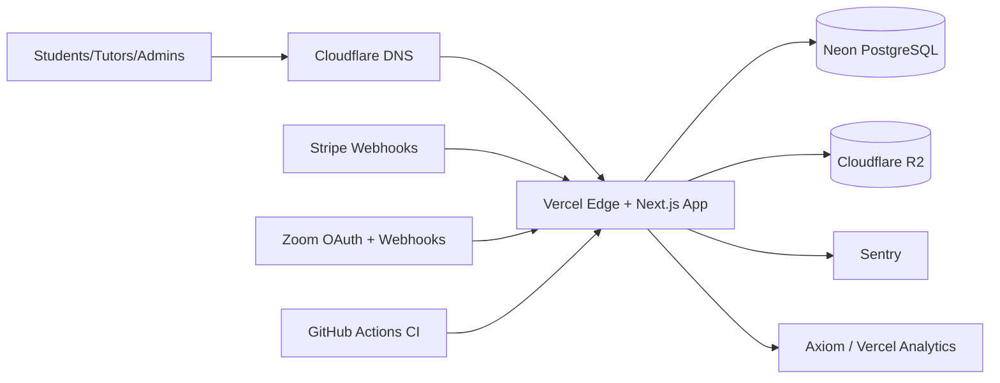

# LinguistPro Production Infrastructure Topology

Last updated: 2026-04-27
Owner: Engineering Lead / Platform
Status: Approved for current production-readiness execution

This document is the canonical production topology for LinguistPro.
It defines deployment targets, DNS/TLS boundaries, and integration paths for payments, Zoom, and observability.

## Target Stack

- Edge/App hosting: Vercel (Next.js App Router runtime)
- Database: Neon PostgreSQL
- Object storage: Cloudflare R2
- DNS and CDN edge: Cloudflare DNS + Vercel edge delivery
- Error tracking: Sentry
- Structured logs and analytics: Axiom + Vercel analytics

## Environment Matrix

| Environment | App Runtime | Database | Storage | Domain |
| --- | --- | --- | --- | --- |
| Local dev | `next dev` / systemd local service | Local PostgreSQL | Optional local/mock | `http://127.0.0.1:3001` |
| Staging | Vercel project env `staging` | Neon staging branch/db | R2 staging bucket | `staging.<prod-domain>` |
| Production | Vercel project env `production` | Neon production branch/db | R2 production bucket | `<prod-domain>` |

## Topology Diagram

## DNS and TLS Boundaries

- Cloudflare manages DNS zone and records for staging/production hostnames.
- Vercel manages TLS certificates for application hostnames.
- Webhook callback URLs are environment-specific and always use HTTPS.
- No direct public database access from client/browser; DB is server-side only.

## Network and Access Boundaries

- Browser clients communicate only with HTTPS app endpoints.
- Server-side API routes hold all secrets and execute DB/provider calls.
- Provider tokens are scoped by environment (`staging` vs `production`).
- Admin APIs remain behind role checks and middleware guards.

## Payment and Zoom Integration Paths

- Stripe:
  - Outbound: create checkout/session intents from server APIs.
  - Inbound: webhook endpoint validates signatures and updates billing state.
- Zoom:
  - Outbound: OAuth token exchange + meeting/session creation from server APIs.
  - Inbound: webhook endpoint validates event authenticity and records attendance/recordings.

## Deploy and Rollback Links

- Provisioning workflow: `ops/infra/PROVISIONING_RUNBOOK.md`
- IaC baseline and ownership: `ops/infra/terraform/README.md`
- Deploy preflight: `ops/deploy/preflight.sh`
- Launch gate: `ops/deploy/launch-checklist.sh`
- Rollback: `docs/DEPLOY_ROLLBACK_RUNBOOK.md`

## Approval Snapshot

- Decision source: `docs/INFRA_DECISION.md`
- Approval date: 2026-04-27
- Accepted by: Engineering Lead / Codex execution workflow
